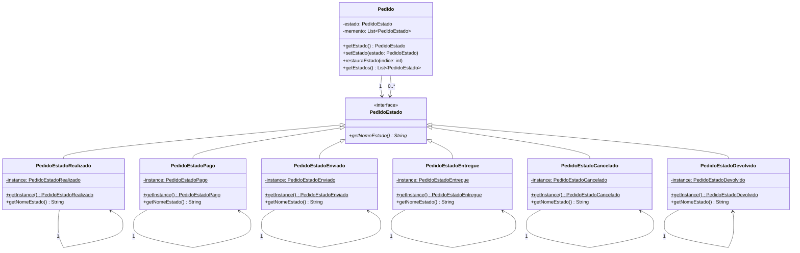

# Diagrama UML — Memento (Histórico de Pedido)

```mermaid
classDiagram
    class Pedido {
        -estado: PedidoEstado
        -memento: List~PedidoEstado~
        +getEstado() PedidoEstado
        +setEstado(estado: PedidoEstado)
        +restauraEstado(indice: int)
        +getEstados() List~PedidoEstado~
    }

    class PedidoEstado {
        <<interface>>
        +getNomeEstado()* String
    }

    class PedidoEstadoRealizado {
        -instance: PedidoEstadoRealizado$
        +getInstance() PedidoEstadoRealizado$
        +getNomeEstado() String
    }

    class PedidoEstadoPago {
        -instance: PedidoEstadoPago$
        +getInstance() PedidoEstadoPago$
        +getNomeEstado() String
    }

    class PedidoEstadoEnviado {
        -instance: PedidoEstadoEnviado$
        +getInstance() PedidoEstadoEnviado$
        +getNomeEstado() String
    }

    class PedidoEstadoEntregue {
        -instance: PedidoEstadoEntregue$
        +getInstance() PedidoEstadoEntregue$
        +getNomeEstado() String
    }

    class PedidoEstadoCancelado {
        -instance: PedidoEstadoCancelado$
        +getInstance() PedidoEstadoCancelado$
        +getNomeEstado() String
    }

    class PedidoEstadoDevolvido {
        -instance: PedidoEstadoDevolvido$
        +getInstance() PedidoEstadoDevolvido$
        +getNomeEstado() String
    }

    Pedido --> PedidoEstado : 1
    Pedido --> PedidoEstado : 0..*

    PedidoEstado <|-- PedidoEstadoRealizado
    PedidoEstado <|-- PedidoEstadoPago
    PedidoEstado <|-- PedidoEstadoEnviado
    PedidoEstado <|-- PedidoEstadoEntregue
    PedidoEstado <|-- PedidoEstadoCancelado
    PedidoEstado <|-- PedidoEstadoDevolvido

    PedidoEstadoRealizado --> PedidoEstadoRealizado : 1
    PedidoEstadoPago --> PedidoEstadoPago : 1
    PedidoEstadoEnviado --> PedidoEstadoEnviado : 1
    PedidoEstadoEntregue --> PedidoEstadoEntregue : 1
    PedidoEstadoCancelado --> PedidoEstadoCancelado : 1
    PedidoEstadoDevolvido --> PedidoEstadoDevolvido : 1
```
